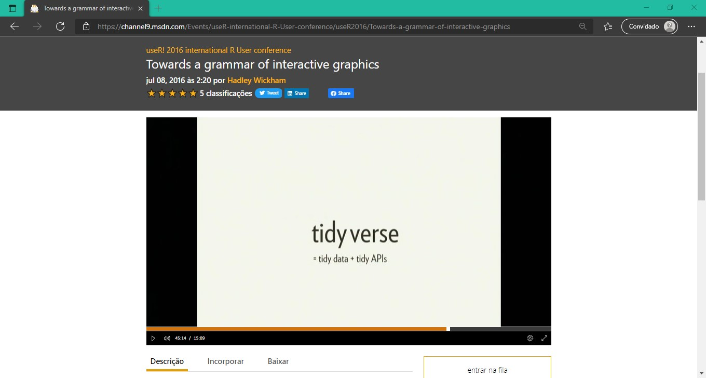
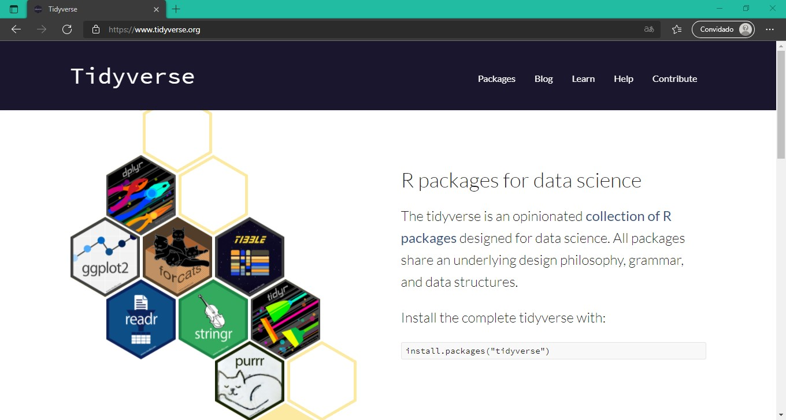
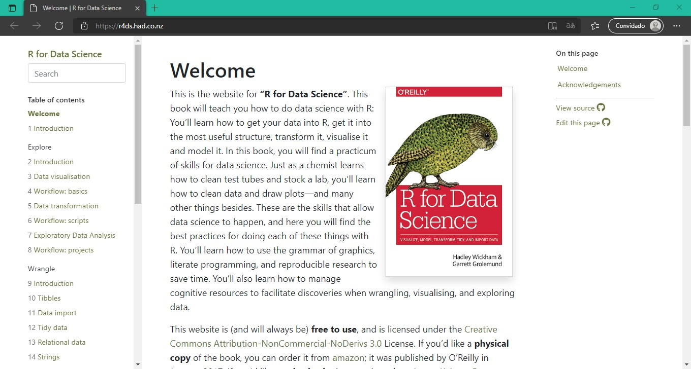
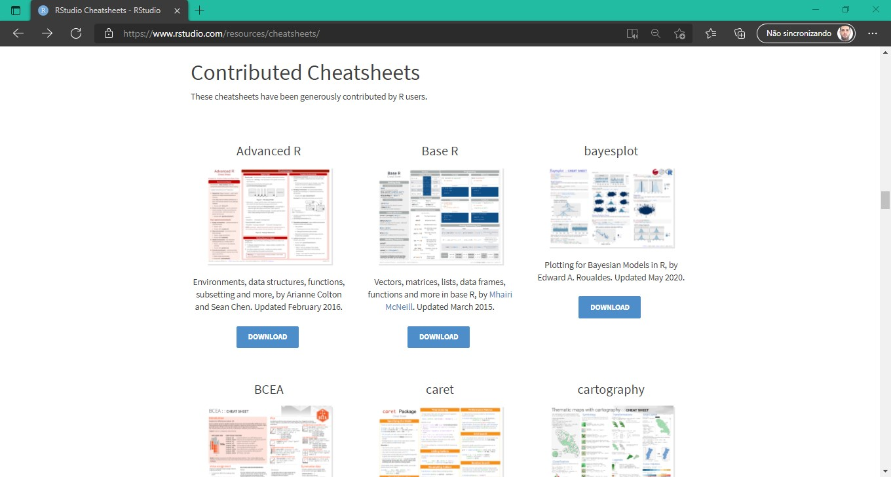

```{r setup, include=FALSE}
options(htmltools.dir.version = FALSE)
knitr::opts_chunk$set(
  fig.width=5, fig.height=4, 
  fig.retina=3, fig.align = "center",
  out.width = "100%",
  cache = FALSE,
  echo = TRUE,
  eval = FALSE,
  message = FALSE, 
  warning = FALSE,
  hiline = TRUE,
  fig.align = "center"
)
```


```{r eval=FALSE, include=FALSE}
# remotes::install_github("hadley/emo")
# remotes::install_github("gadenbuie/xaringanExtra")
# remotes::install_github("gadenbuie/ermoji")
# install.packages("xaringanthemer")
```

```{r xaringanExtra-clipboard, echo=FALSE}
xaringanExtra::use_clipboard()
```


```{r xaringan-themer, include=FALSE, warning=FALSE}
# library(xaringanthemer)
# style_xaringan(
#   outfile = "xaringan-themer.css",
#   code_font_google = google_font("Fira Code")
# )
# style_duo_accent(outfile = "xaringan-themer.css",
#   primary_color = "#41ae76",
#   title_slide_background_color = "#41ae76",
#   title_slide_text_color = "#FFFFFF",
#   inverse_text_color = "#41ae76",
#   inverse_header_color = "#41ae76",
#   secondary_color = "#a7a3b4",
#   title_slide_background_size = "300",
#   header_font_google = google_font("Jost"),
#   text_font_google   = google_font("Work Sans", "300", "300i"),
#   code_font_google   = google_font("Fira Code"),
#   base_font_size = "20px"
# )
```


# Temas de hoje

- O que é Tidyverse

- Livro de Referência

- Os pacotes

- Exemplos

- Cartas de comandos

- Referências

---

# O que é Tidyverse

Até 2016 o termo **hadleyverse** era utilizado como referência aos pacotes criados pelo Hadley Wickham. Mas na UseR 2016 ele cunhou o termo **Tidyverse**, utilizado desde então.

.pull-left[
```{r}
#| echo = FALSE,
#| eval = TRUE,
#| out.width="100%",
#| fig.cap = '<a href="http://hadley.nz/">http://hadley.nz</a>'


```
]

.pull-right[
```{r}
#| echo = FALSE,
#| eval = TRUE,
#| out.width="100%",
#| fig.cap = '<a href="https://channel9.msdn.com/Events/useR-international-R-User-conference/useR2016/Towards-a-grammar-of-interactive-graphics">Tidy tools for data science (aka Tidyverse)</a>'


```
]

---

# O que é Tidyverse

```{r}
#| echo = FALSE,
#| eval = TRUE,
#| out.width="80%",
#| fig.cap = '<a href="https://www.tidyverse.org">https://www.tidyverse.org</a>'


```


---

# Livro de Referência

```{r}
#| echo = FALSE,
#| eval = TRUE,
#| out.width="80%",
#| fig.cap = '<a href="https://r4ds.had.co.nz/">https://r4ds.had.co.nz</a>'


```


---

# Os pacotes

.pull-left[

```{r}
install.packages("tidyverse")
```

```{r}
install.packages("ggplot2")
install.packages("dplyr")
install.packages("tidyr")
install.packages("readr")
install.packages("purrr")
install.packages("tibble")
install.packages("stringr")
install.packages("forcats")
install.packages("lubridate")
install.packages("hms")
install.packages("DBI")
install.packages("haven")
install.packages("httr")
install.packages("jsonlite")
install.packages("readxl")
install.packages("rvest")
install.packages("xml2")
install.packages("modelr")
install.packages("broom")
```
]

.pull-right[

```{r}
library("tidyverse")
```

```{r}
library("ggplot2")
library("dplyr")
library("tidyr")
library("readr")
library("purrr")
library("tibble")
library("stringr")
library("forcats")
```
]


---

# Os pacotes

```{r}
#| echo = FALSE,
#| eval = TRUE,
#| out.width="90%",
#| fig.cap = '<a href="https://osf.io/69gub/wiki/home/">https://osf.io/69gub/wiki/home/</a>'

knitr::include_graphics("img/data-science_cicle_packages.png")
```


---

class: inverse, center

# Exemplos!

```{r}
#| echo = FALSE,
#| eval = TRUE,
#| out.width="50%",

knitr::include_graphics("img/cat-computer.gif")
```


---

```{r, eval=TRUE, message=TRUE, warning=FALSE}
library(tidyverse)
library(broom)
```


---

# Importando dados com **readr** e **tibble**

```{r, eval=TRUE}
dados_raw <- read_csv2(
  "https://github.com/italocegatta/italocegatta.github.io_source/raw/master/content/dados/tume_55_24.csv"
)

dados_raw
```

---

# Manipulando dados com **dplyr** e **pipe**

```{r, eval=TRUE}
dados <- dados_raw %>% 
  select(Esp, DAP_cm, H_m) %>% 
  filter(Esp %in% c("E_saligna", "E_urophylla"))

dados
```


---

# Manipulando dados com **dplyr** e **pipe**

```{r, eval=TRUE}
dados %>% 
  select(
    especie = Esp, 
    dap = DAP_cm
  ) %>% 
  group_by(especie) %>% 
  summarise(
    n_vivas = sum(!is.na(dap)),
    dap_medio = mean(dap, na.rm = TRUE)
  )
```


---

# Fazendo gráficos com **ggplot2**

```{r, eval=TRUE}
#| out.width="40%"

ggplot(dados, aes(DAP_cm, H_m)) +
  geom_point(alpha=0.4) +
  geom_smooth(method="lm") +
  facet_wrap(~Esp) +
  theme_bw()
```


---

# Reformatando dados com **tidyr**

```{r, eval=TRUE}
dados %>%
  group_by(Esp) %>% 
  nest()
```


---

# Programação funcional com **purrr**

```{r, eval=TRUE}
dados_modl <- dados %>%
  group_by(Esp) %>% 
  nest() %>% 
  mutate(
    ajuste = map(data, ~ lm(log(H_m) ~ I(1/DAP_cm), data = .x)),
    resumo = map(ajuste, glance)
  )

dados_modl
```


---

# Desempacotando os dados

```{r, eval=TRUE}
dados_modl %>%
  select(Esp, resumo) %>% 
  unnest(resumo)
```


---

# Aplicando os modelos

```{r, eval=TRUE}
dados_pred <- dados_modl %>% 
  mutate(
    hpred = map2(ajuste, data, ~ exp(predict(.x, newdata = .y)))
  ) %>%
  select(Esp, data, hpred)

dados_pred
```


---

# Dados preditos

```{r, eval=TRUE}
dados_compl <- dados_pred %>%
  unnest(data, hpred)

dados_compl
```


---

# Observado vs Predito

```{r, eval=TRUE}
#| out.width="40%",
#| out.height="20%"

dados_compl %>% 
  ggplot(aes(H_m, hpred)) +
    geom_point() +
    geom_abline() +
    facet_wrap(~Esp) +
    theme_bw()
```

---

# Cartas de comandos

```{r}
#| echo = FALSE,
#| eval = TRUE,
#| out.width="80%",
#| fig.cap = '<a href="https://www.rstudio.com/resources/cheatsheets/">https://www.rstudio.com/resources/cheatsheets/</a>'


```

---

# Referências

- Gimenez, Olivier. 2020. Introduction to the Tidyverse. https://github.com/oliviergimenez/intro_tidyverse

- Grolemund, Garrett. 2019. Remaster the Tidyverse. https://github.com/rstudio-education/remaster-the-tidyverse

- Wickham, Charlotte. 2018. Data Science in the tidyverse https://github.com/cwickham/data-science-in-tidyverse

- Wickham, Hadley. 2014. Tidy data. The Journal of Statistical Software 59 (10). http://www.jstatsoft.org/v59/i10/

- Wickham, Hadley. 2016. ggplot2: Elegant Graphics for Data Analysis. Springer-Verlag. https://ggplot2-book.org/

- Wickham, Hadley and Garrett Grolemund. 2016. R for Data Science. O’Reilly Media. http://r4ds.had.co.nz/


---

class: inverse, center, middle

## Obrigado!
